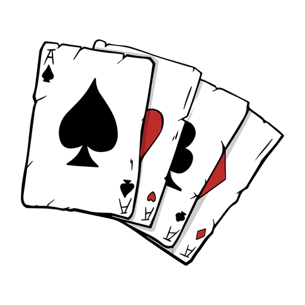

# Projeto Individual de Algoritmo - Lucky Shot

Este repositório contém o projeto desenvolvido para a disciplina de Algoritmo da faculdade São Paulo Tech School. O projeto tem como objetivo ser uma plataforma de jogos, incluindo **Genius**, **Termo**, **Campo Minado**, **Blackjack** e **Sete e Meio**, além de funcionalidades avançadas como tela de configuração de usuário, telas de pausa com manual, estatísticas detalhadas e ranking entre jogadores de cada jogo.

---

## Visão Geral do Projeto

O **Lucky Shot** é uma plataforma de jogos voltada para imersão e competição, proporcionando experiências interativas e personalizadas aos seus usuários. Ele inclui:

- **Blackjack**: Jogo de cartas com o objetivo de alcançar a pontuação mais próxima de 21.
- **Sete e Meio**: Jogo onde o objetivo é atingir a pontuação mais próxima de 7,5.
- **Genius**: Jogo de memória que desafia o jogador a seguir sequências de cores.
- **Termo**: Jogo de palavras onde o objetivo é adivinhar a palavra correta com base em dicas.
- **Campo Minado**: Jogo clássico de estratégia onde o objetivo é desativar bombas sem detoná-las.
- **Tela de Configuração de Usuário**: Permite personalizar o perfil do usuário e ajustes de preferências.

## Tecnologias Utilizadas

 
  

  
  
  
  
    
  
    

## Motivação

Este projeto foi desenvolvido primeiramente como um desafio de lógica do primeiro semestre da faculdade, desenvolver o jogo <strong>Sete e Meio</strong>. Porém, com motivação e criatividade, experimentei criar uma plataforma com diversos jogos, rankings dinâmicos entre os jogadores e gerenciamento de usuários. Isso me fez evoluir muito como desenvolvedor e profissional, podendo aperfeiçoar diversos ambitos técnicos.

---

## Como Contribuir

Se deseja contribuir para o desenvolvimento do Lucky Shot, sinta-se à vontade para abrir uma issue ou enviar um pull request com novas funcionalidades, correções de bugs ou melhorias no design. Qualquer sugestão é bem-vinda!

---

## Conexão com a Comunidade

Para qualquer dúvida ou troca de ideias, entre em contato pelo GitHub ou pelas redes sociais:

- **GitHub**: [Joao-Noce](https://github.com/Joao-Noce/Lucky-Shot)
- **LinkedIn**: [João-Noce](https://www.linkedin.com/in/joao-noce/)

---

&copy; 2025 Lucky Shot. Todos os direitos reservados.
